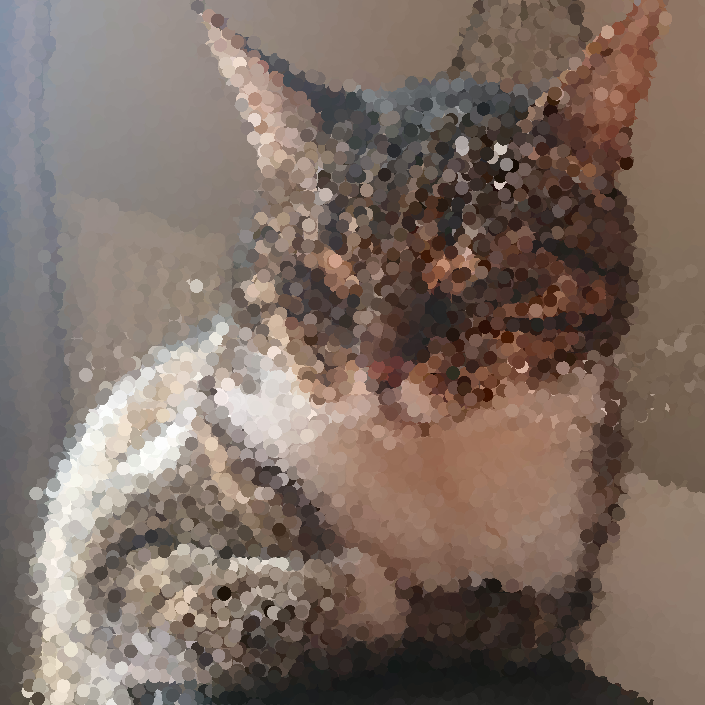

# Van Gogh pointillism
Turn your photos into Van Gogh paintings in pointillism style! 

## Execution notes

In order to pointillize your image, do the following:
- Install all requirements
```shell script
pip install -r requirements/local.txt
```
- Place all images you want to pointillize in the folder `img/input`
- Run the script, e.g.
```shell script
python -m main --grid_sizes 1 2 5 --grid_types hex square
```
- To find all options of the script explained, run
```shell script
python -m main --help
```
- Find all pointillized images in the folder `img/output`

Running the code requires Python 3.8 or up. 

Example input:


Example output with hexagonal grids:
  

Example output with square grids:
 |  | 

Example output with random grids:
 |  | 

## TODOs
- [ ] Profile the script, and optimize where possible
